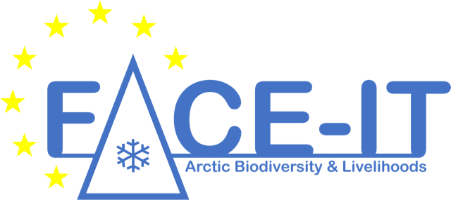
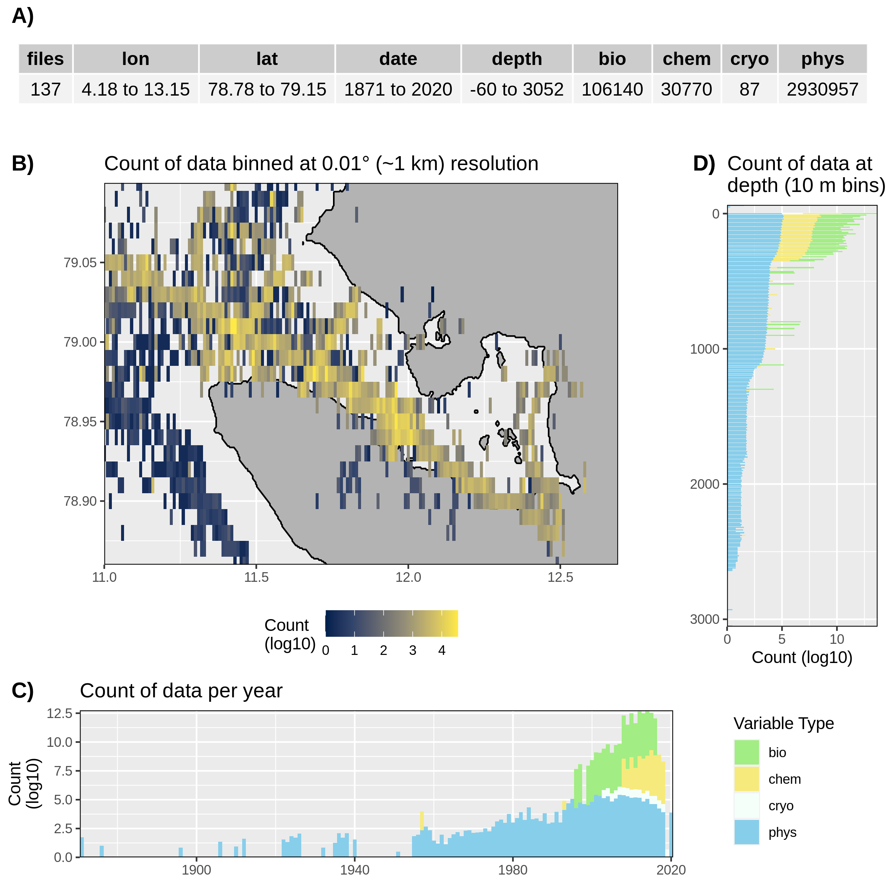

```{r global_options, include = FALSE}
knitr::opts_chunk$set(fig.width = 8, fig.align = 'center',
                      echo = FALSE, warning = FALSE, message = FALSE, 
                      eval = TRUE, tidy = FALSE)
```

<center>
{ width=70% }
</center>

<br>

[Guiding structure not to be included in final presentation]  
"WP reports: What has the WP as a whole done in the last year? How is the workflow going? How is interaction with other working? What were the issues? Next steps?"


# Structure
***

{ width=30% }  
  
- WP Lead: Jean-Pierre Gattuso

<br>

{ width=30% }  
  
- Data Scientist: Robert Schlegel

<br>


# Deliverables delivered
***

- D1.1: [Report on key drivers](https://face-it-project.github.io/WP1/key_drivers.html) (6 months)
- D8.1: Data management plan (6 months)
- D1.2: [Meta-database](https://face-it-project.github.io/WP1/metadatabase.html) (12 months)
- Created [GitHub repository](https://github.com/FACE-IT-project) for FACE-IT
- All WP1 progress available on [public website](https://face-it-project.github.io/WP1/index.html)

<br>


# Cross-package interactions
***

- Ny-Ålesund, Kongsfjorden, Svalbard (July - August, 2021)
  - Participated in fieldwork for WP3
  - Worked adjacent to WP2
- Data collections efforts

## Effective coordination of data collection 

- Who is responsible for what?
- Who has other people working with data collection?
- WP1 is of service to everybody, but we can't provide this service without replies to our inquiries

<br>


# Data issues
***

- What to do with complex data types
  - e.g. Seabird database and geospatial glacier fronts

## Inglefieldbukta

- Is the current Inglefieldbukta bounding box to small?
- What is the scientific justification of choosing a much larger semi-open fjord?
- Current area (figure)
- Potential expanded area (figure)

<br>


# What's next?
***

- D1.3: [Review article](https://face-it-project.github.io/WP1/review.html) (24 months)
  - Intended as broad overview of drivers of change in FACE-IT study sites
  - Will require expertise from many FACE-IT researchers
  - WP1 will reach out to site coordinators as fist step in collaborative process

<br>


## Regional data analyses

- Summary analysis of all sites available [here](https://face-it-project.github.io/WP1/data_summary.html)
  - https://face-it-project.github.io/WP1/data_summary.html
  
```{r fig.cap="__Figure 1__: Summary of data collected for Kongsfjorden. A) Table of meta-data. B) Count (log10) of data points available per 1 km square. C) Count (log10) of data points per year. D) Count of data points per 10 m depth. Colours in C and D show the category of the data: bio = biological, chem = chemical, cryo = cryosphere, phys = physical."}

```


<br>
<br>
<br>

